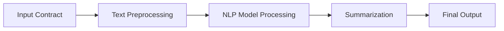

# 📄 NLP Contract Summarizer for Rental Agreements

<p align="center">
  <b>AI-powered tool to summarize rental agreements into simple, readable insights</b>
</p>

---

<p align="center">
  
  
  
  
</p>

---

## 🚀 Overview

This project uses **Natural Language Processing (NLP)** to analyze and summarize rental agreements into concise, easy-to-understand summaries.

It helps users quickly understand:

* Key clauses
* Important conditions
* Hidden risks

---

## ✨ Features

* 📄 Extracts important information from contracts
* 🤖 AI-powered text summarization
* ⚡ Fast and efficient processing
* 📌 Highlights key clauses and terms
* 🧠 Reduces legal complexity for users

---

## 🧠 How It Works



---

## 📂 Project Structure

```id="0v2a4q"
├── data/
├── models/
├── utils/
├── app.py
├── requirements.txt
└── README.md
```

---

## ⚙️ Installation

```bash id="x7l1v0"
git clone https://github.com/UtsavRaj1111/NLP-contract-summarizer-for-rental-agreements.git
cd NLP-contract-summarizer-for-rental-agreements
pip install -r requirements.txt
```

---

## ▶️ Usage

```bash id="v3pz5t"
python app.py
```

👉 Provide a rental agreement text → get summarized output

---

## 📌 Example

**Input:**

```txt id="6k9p1l"
This agreement is made between the landlord and tenant...
```

**Output:**

```txt id="z7x2pd"
- Lease duration: 12 months  
- Monthly rent: ₹10,000  
- Security deposit required  
- Termination requires 30 days notice  
```

---

## 🔐 Privacy & Security

* No data is stored permanently
* All processing is local / controlled
* No third-party sharing

---

## 📊 Tech Stack

* 🐍 Python
* 📚 NLP (NLTK / spaCy / Transformers)
* 🤖 Machine Learning Models

---

## 🚧 Future Improvements

* 🌐 Web UI for easy interaction
* 📊 Clause classification
* 🗂️ Multi-document support
* 🔍 Risk detection system

---

## 🤝 Contributing

Contributions are welcome!

```bash id="v8tq1j"
git fork
git clone
git commit -m "improvement"
git push
```

---

## ⭐ Support

If you like this project:

👉 Star the repository
👉 Share with others

---

## 📄 License

MIT License © 2026

---

<p align="center">
  Made with ❤️ by UtsavRaj1111
</p>
